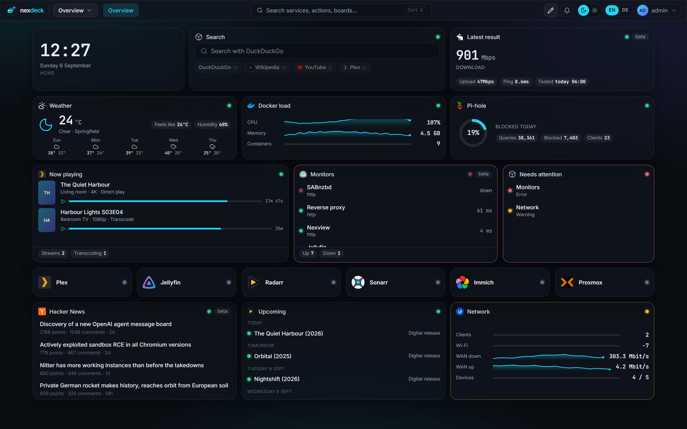
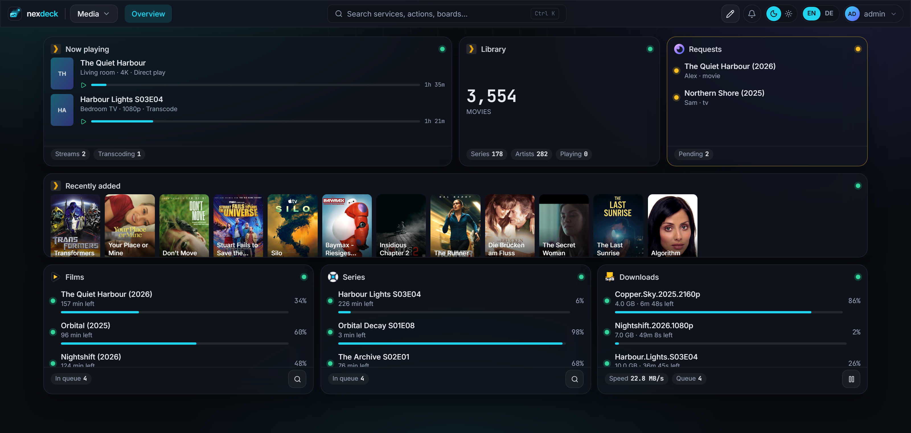
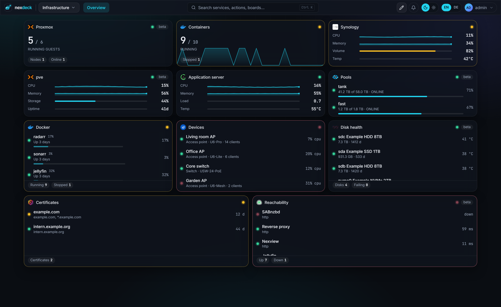
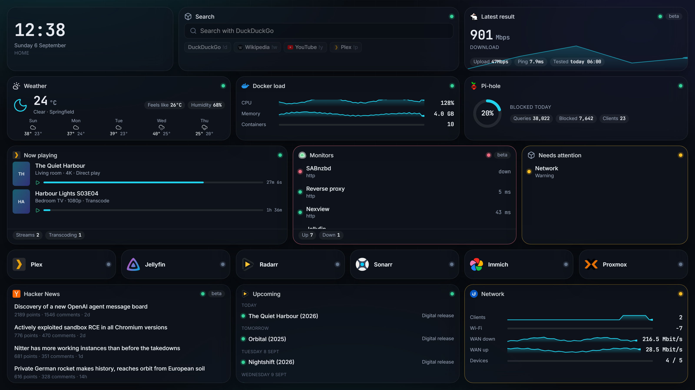

# nexdeck

**The live homelab dashboard.** Cards that move, actions on the cards, boards for the desk, the phone and the wall.

nexdeck is the fourth member of the nexapps family, next to [Nexview](https://nexview.nexapps.dev), nexmail and the Nexview Home Assistant integration.

[](https://github.com/DerKezorm/nexdeck/actions/workflows/ci.yml)
[](https://github.com/DerKezorm/nexdeck/pkgs/container/nexdeck)
[](LICENSE)
[](#the-services-it-speaks-to)



## What it does

- **Live, not polled by your browser.** The server asks every service in its own rhythm and pushes changes to every open browser. Ten tabs cost a service one request.
- **Seventy-nine integrations,** listed in full [further down](#the-services-it-speaks-to). Generic building blocks for everything else: a JSON API widget, a calendar that merges several sources, iframes, notes and bookmarks.
- **Actions where the data is.** Restart a container, start a VM, pause downloads, approve a request, wake a machine, flip a light. Destructive actions confirm once. Everything is logged.
- **Three screens.** A free grid with its own arrangement per screen size, an installable phone app with a bottom bar, and kiosk links for wall tablets that cycle pages and dim at night.
- **Users, roles and sharing.** Administrators, users and guests. Boards are private, shared with people or with a whole role, at view, edit or act level.
- **Reachability and notifications.** App tiles carry a check with uptime bars; outages reach you through Telegram, e-mail, Web Push, ntfy, Gotify, Discord, Slack or Apprise.
- **Boards as files.** Export a board as YAML, keep it in Git, drop it into `data/boards/` to provision it. Docker labels create tiles.
- **Sign in your way.** Local accounts, OpenID Connect (authentik, Keycloak, Authelia, Pocket ID and friends), personal API tokens.

## A board is whatever you put on it

Every card is a widget of one integration, dropped on a free grid and sized by hand. Nothing here is a fixed template.

### Media

What is playing, what the library holds, what is on its way in, and the covers of what arrived last.



### Infrastructure

The same grid, a different question. Hosts, containers, pools, disks, certificates and what answers.



### On the wall

A kiosk link opens one board without a sign-in, read-only unless you say otherwise. It cycles through the pages and dims at night. The token is handed in once at the door and never rides in an address afterwards.



## Quick start

```bash
mkdir nexdeck && cd nexdeck
curl -fsSL https://raw.githubusercontent.com/DerKezorm/nexdeck/main/docker-compose.yml -o docker-compose.yml
docker compose up -d
```

Open `http://your-host:5175`. The first start creates the administrator and offers a demo board with invented, moving data, so you can look around before connecting anything.

Mount `/var/run/docker.sock` (already in the compose file) to see this host's containers, act on them and follow their logs. On Synology the same socket serves Container Manager.

### Configuration

| Variable | Default | Purpose |
|---|---|---|
| `NEXDECK_SECRET_KEY` | generated into `/data/secret.key` | Encrypts stored API keys and signs sessions. Set it once and keep it. |
| `NEXDECK_PUBLIC_URL` | empty | How browsers reach nexdeck. Needed for OpenID Connect and Web Push. |
| `NEXDECK_URL_BASE` | empty | Sub path when nexdeck runs below one, e.g. `/deck`. |
| `NEXDECK_DEMO` | `0` | Start every widget with invented data. |
| `NEXDECK_LOG_LEVEL` | `INFO` | `DEBUG` logs every adapter request. |
| `PUID`, `PGID` | `1000` | Owner of the files in the data volume. |
| `DOCKER_GID` | detected | Group of the mounted Docker socket, when detection fails. |

All variables are listed in [`.env.example`](.env.example).

### Reverse proxy

nexdeck speaks plain HTTP on port 8000 and trusts `X-Forwarded-Proto` for its cookies. Server-Sent Events need a proxy that does not buffer: for nginx, `proxy_buffering off;` on the location; Traefik and Caddy need nothing.

## The services it speaks to

**Hosts and containers.** Docker, Proxmox VE, Proxmox Backup Server, Portainer, Coolify, Synology DSM, Unraid, TrueNAS, Glances, Beszel, Prometheus, Grafana, Scrutiny, UPS through PeaNUT, Wake-on-LAN.

**Network.** UniFi, MikroTik, FRITZ!Box, OPNsense, pfSense, Traefik, Nginx Proxy Manager, Pi-hole, AdGuard Home, Technitium, NextDNS, Tailscale, Headscale, Gluetun, authentik, Speedtest Tracker, Uptime Kuma.

**Media.** Plex, Jellyfin, Emby, Tautulli, Jellystat, Radarr, Sonarr, Lidarr, Readarr, Prowlarr, Bazarr, SABnzbd, NZBGet, qBittorrent, Transmission, Deluge, Seerr, Overseerr, Jellyseerr, Nexview, Maintainerr, Tdarr, Unmanic, FileFlows.

**Home and files.** Home Assistant, Frigate, Reolink, evcc, Immich, Nextcloud, Syncthing, Paperless-ngx, Audiobookshelf, Navidrome, Komga, Kavita, Calibre-Web.

**Feeds, weather and messages.** Hacker News, YouTube, GitHub releases, share prices, Twitch, RSS, iCal, Weather, ntfy, Gotify.

Adapters that have not been confirmed against a live instance yet carry a *beta* badge in the interface. If one misbehaves, please open an issue with the service's version.

## Documentation

- [Integrations and widgets](docs/adapters.md)
- [Docker labels](docs/labels.md)
- [Boards as files and provisioning](docs/provisioning.md)
- [Kiosk displays](docs/kiosk.md)
- [API](docs/api.md)

## Development

Backend: Python 3.13, FastAPI, SQLAlchemy, SQLite. Frontend: React 19, Vite 7, Tailwind 4.

```bash
# backend
cd backend
python -m venv .venv && . .venv/bin/activate
pip install -r requirements-dev.txt
uvicorn app.main:app --reload --port 8000

# frontend, in a second terminal
cd frontend
npm ci
npm run dev
```

The frontend on `http://localhost:5176` proxies `/api` to the backend. Tests: `python -m pytest` in `backend/`, `npm test` and `npm run e2e` in `frontend/`. The guards in `backend/tests/test_guards.py` and `frontend/src/i18n/*.test.ts` enforce English messages, complete translations, an auth decision on every address and no personal data in the repository.

### Adding an adapter

One file in `backend/app/adapters/`: declare the connection fields and the widgets, implement `test`, `fetch`, optionally `action`, and `demo`. Every widget maps onto one of fifteen renderers, so no frontend code is needed. See [docs/adapters.md](docs/adapters.md).

## License

AGPL-3.0-or-later. See [LICENSE](LICENSE).
